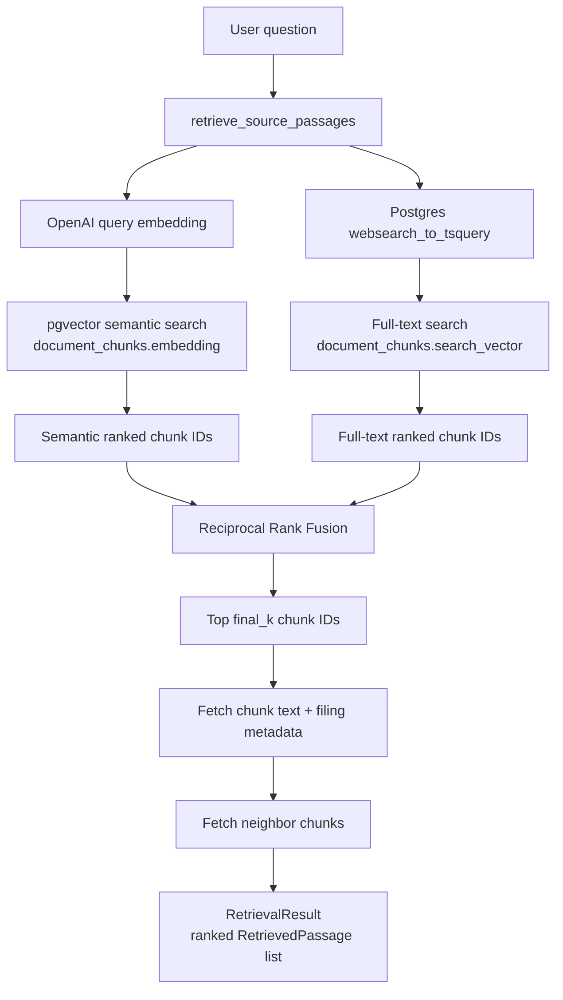

# Retrieval Pipeline

Phase 7 retrieval returns ranked source passages from the ingested SEC filing corpus. It does not generate answers; later agent code should consume the returned passages as the only allowed evidence.

## Defaults

`RetrievalSettings` lives in `schemas.py`.

| Setting | Default | Meaning |
| --- | ---: | --- |
| `candidate_k` | `50` | Number of candidates requested from each backend: semantic search and full-text search. |
| `final_k` | `10` | Number of fused passages returned to the caller. |
| `rrf_k` | `60` | Reciprocal Rank Fusion smoothing constant. Higher values soften rank differences. |
| `neighbor_window` | `1` | Number of adjacent chunks to fetch before and after each final hit. |

`RetrievalFilters` can narrow the corpus by:

- `company`, normalized to uppercase before querying
- `filing_year`
- `filing_type`, normalized to uppercase before querying

Query embeddings use the existing app settings:

- `settings.openai_embedding_model`
- `settings.openai_embedding_dimensions`

At the time of writing, those default to `text-embedding-3-small` and `1536`.

## How It Works

The public entrypoint is `retrieve_source_passages(db, query, filters=None, retrieval_settings=None)` in `retriever.py`.

1. The user query is stripped and rejected if empty.
2. `embed_query()` embeds the query with OpenAI.
3. `semantic_search()` retrieves chunks from `document_chunks.embedding` using pgvector cosine distance.
4. `full_text_search()` retrieves chunks from `document_chunks.search_vector` using `websearch_to_tsquery('english', query)`.
5. `reciprocal_rank_fusion()` combines ranked chunk IDs from both backends using rank positions, not raw scores.
6. `fetch_hits_by_ids()` loads the final chunk metadata and text in fused order.
7. `fetch_neighbor_chunks()` loads adjacent chunks from the same source document for extra context.
8. The result is returned as `RetrievalResult` with `RetrievedPassage` objects.

Each `RetrievedPassage` includes the chunk ID, source document ID, company, filing year, filing type, source URL, chunk index, content, metadata, fused rank/score, per-backend rank/score, and neighbor chunk text.

## Diagram



## Why RRF

Semantic scores and full-text scores are not directly comparable. pgvector cosine similarity and Postgres `ts_rank_cd` have different scales, so the pipeline fuses rankings instead of averaging scores:

```text
rrf_score(chunk) = sum(1 / (rrf_k + rank_in_backend))
```

This follows the hybrid retrieval pattern from the reference cookbook while replacing BM25 with Postgres full-text search.

## Notes For The Agent Layer

The retrieval package is deliberately answer-free. The future LLM agent should treat returned passages as the complete evidence set, validate citations against `chunk_id`, and refuse unsupported claims instead of asking retrieval to make judgment calls.
