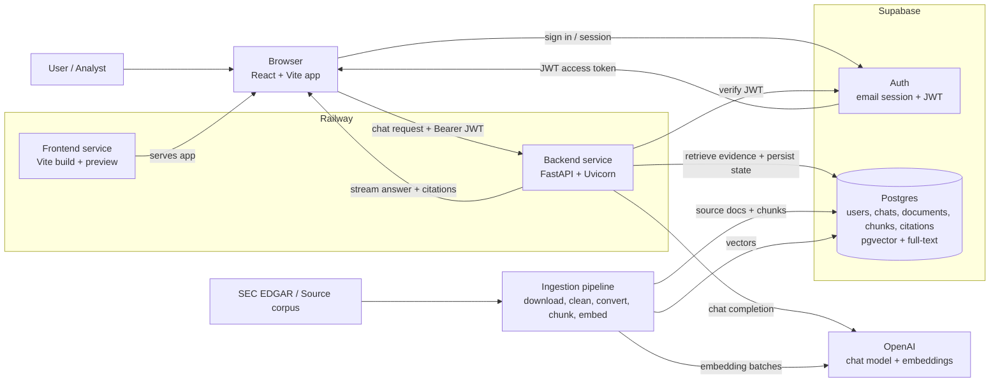

# Reusable Architecture

Use this architecture for future grounded document assistants where users ask questions over a curated corpus and answers must cite source evidence.

## Core Principle

The backend owns trust. The frontend should never call OpenAI directly, never run retrieval, and never hold service-role credentials. The backend verifies identity, retrieves passages, builds evidence, calls the LLM, validates citations, and persists the result.

## Service Diagram

## Runtime Request Flow

1. User signs in through Supabase Auth in the React app.
2. Frontend stores the Supabase session through `@supabase/supabase-js`.
3. Frontend calls FastAPI with `Authorization: Bearer <supabase_access_token>`.
4. FastAPI verifies the token and rejects unauthenticated requests before retrieval or OpenAI calls.
5. Backend loads or creates the chat thread.
6. Backend plans retrieval from the user question.
7. Backend retrieves source passages using vector search and full-text search.
8. Backend fuses ranked results and adds neighboring chunk context.
9. Backend extracts structured evidence from retrieved passages.
10. Backend performs deterministic calculations where possible.
11. Backend asks the LLM to produce an answer using only the verified evidence.
12. Backend validates citations and numeric claims.
13. Backend streams the answer to the frontend.
14. Backend persists user message, assistant message, and message citations.

## Data Model Shape

Use these tables as a starting point:

- `users`: application users mirrored from Supabase identity.
- `source_documents`: one row per source filing/document.
- `document_chunks`: chunks with content, metadata, embedding, and generated full-text vector.
- `chat_threads`: user-owned conversations.
- `chat_messages`: persisted user/assistant messages.
- `message_citations`: links assistant messages to supporting chunks.

Important indexes:

- HNSW index on `document_chunks.embedding`.
- GIN index on `document_chunks.search_vector`.
- B-tree indexes on source document filters such as `company`, `filing_year`, and foreign keys.

## Trust Boundaries

Frontend can:

- hold Supabase anon key;
- hold the user JWT;
- render messages and citations;
- call FastAPI with the bearer token.

Frontend must not:

- hold service-role key;
- hold database URL;
- hold OpenAI API key;
- call OpenAI directly;
- decide what evidence is valid.

Backend can:

- hold service-role key;
- hold database URL;
- hold OpenAI API key;
- verify Supabase tokens;
- retrieve passages;
- run evidence validation;
- persist chat and citations.

Backend must:

- fail closed when auth is missing;
- return "not enough evidence" when the corpus does not support the question;
- avoid exposing secret values in logs or frontend responses.

## Deployment Pattern

Use two Railway services:

- backend root directory: `backend`
- frontend root directory: `frontend`

Keep deployment commands in repo config:

- backend: `uv run --no-dev uvicorn app.main:app --host 0.0.0.0 --port $PORT`
- frontend: `pnpm preview --host 0.0.0.0 --port $PORT`

Use Railway Serverless/App Sleep for low-cost idle projects.

