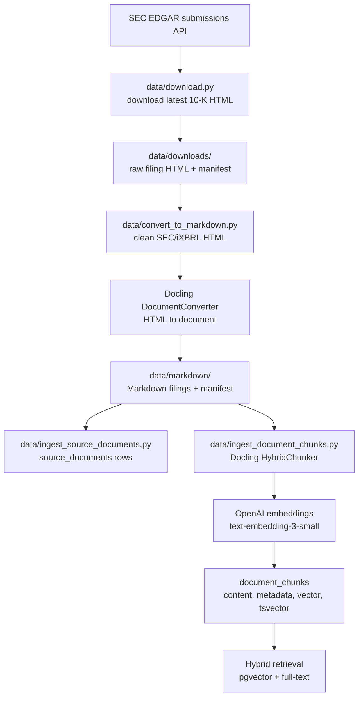

# Reusable Ingestion Pipeline

This is the ingestion approach used for Document Copilot. Reuse it for future projects that need source documents converted into searchable, citable chunks.

## Pipeline Overview

## Corpus Used

The built project used:

- Companies: `AAPL`, `MSFT`, `NVDA`, `AMZN`, `GOOGL`
- Filing type: `10-K`
- Years: `2021`, `2022`, `2023`, `2024`, `2025`
- Total source documents: `25`
- Total chunks after ingestion: `1996`
- Embedding dimensions: `1536`
- Embedding model: `text-embedding-3-small`

## Step 1: Download Source Filings

Script: `data/download.py`

What it does:

- calls SEC EDGAR company submissions JSON;
- finds recent 10-K filings for configured tickers;
- downloads the primary filing HTML;
- groups downloaded files by filing/report year;
- writes `data/downloads/manifest.json`.

Design notes:

- Always set a real SEC `User-Agent`.
- Keep raw downloads out of git.
- Store filing metadata: ticker, CIK, form, filing date, report date, accession number, source URL, local path.
- Rate-limit SEC requests with a small sleep.

## Step 2: Clean SEC HTML and Convert to Markdown

Script: `data/convert_to_markdown.py`

Tools:

- BeautifulSoup for SEC HTML cleanup.
- Docling `DocumentConverter` for document conversion.
- Markdown output for human-readable storage.

What cleanup handles:

- removes scripts, styles, hidden iXBRL tags, hidden elements, and visual-only attributes;
- unwraps inline iXBRL tags;
- normalizes SEC tables that use visual grid/colspan tricks;
- removes repeated empty or duplicate cells;
- converts Docling output to compact Markdown;
- normalizes financial tables where year headers and values need stable Markdown columns.

Why Markdown matters:

- easier to inspect;
- stable input for source-document storage;
- easier for chunking and evidence extraction than raw SEC HTML.

## Step 3: Insert Source Documents

Script: `data/ingest_source_documents.py`

Target table: `source_documents`

Each row stores:

- company/ticker;
- filing type;
- filing year;
- SEC filing URL;
- full converted Markdown content.

Important behavior:

- reads `data/markdown/manifest.json`;
- skips documents that already exist;
- supports `--dry-run`;
- expects Markdown files to exist before source ingest.

## Step 4: Chunk, Embed, and Store Chunks

Script: `data/ingest_document_chunks.py`

Tools:

- Docling `HybridChunker`
- Docling OpenAI tokenizer wrapper
- `tiktoken` `cl100k_base`
- OpenAI embeddings API

Chunking settings:

- default max tokens: `1500`;
- repeat table headers;
- omit repeated headers on overflow;
- merge peers;
- preserve headings/section metadata where available.

Target table: `document_chunks`

Each row stores:

- `source_document_id`;
- `chunk_index`;
- chunk text content;
- chunk metadata JSON;
- embedding vector;
- generated Postgres `search_vector`.

Metadata includes:

- ticker;
- CIK;
- filing type/year/date;
- report date;
- accession number;
- SEC source URL;
- source and Markdown local paths;
- chunk index;
- chunker name;
- embedding model and dimensions;
- token count;
- section/headings;
- raw Docling metadata where serializable.

Useful controls:

- `--dry-run`: chunk locally without DB writes or OpenAI calls.
- `--skip-embeddings`: insert chunks without vectors.
- `--one-chunk`: cheap smoke test.
- `--company AAPL`: process one ticker.
- `--year 2025`: process one year.
- `--limit-docs 1`: process a small sample.
- `--force`: delete/rebuild existing chunks for selected filings.

## Database Search Design

Semantic retrieval:

- `document_chunks.embedding`
- Postgres `pgvector`
- HNSW index
- cosine distance

Lexical retrieval:

- `document_chunks.search_vector`
- generated from chunk content
- Postgres full-text search
- GIN index
- `websearch_to_tsquery`

Fusion:

- run semantic and full-text retrieval separately;
- fuse rankings in Python using Reciprocal Rank Fusion;
- fetch surrounding chunk context for citations.

## Quality Checks

Run these before trusting a corpus:

- source document count equals expected filings;
- chunk count is nonzero and plausible;
- all chunks have embeddings unless intentionally skipped;
- no empty chunks;
- expected companies and years are present;
- vector extension exists;
- HNSW and GIN indexes exist;
- one known financial table can be retrieved and cited;
- out-of-corpus company questions return "not enough evidence".

## Known Ingestion Risks

- SEC/iXBRL tables can shift values between years if table cleanup is too aggressive.
- Footnote labels like `Services (1)` can create duplicate metric names.
- Percentage rows can be mislabeled as monetary rows if unit extraction is too simple.
- Recast segment tables can create apparently conflicting values across filings.
- Latest-year 2025 tables need special review because they exposed several issues during testing.

